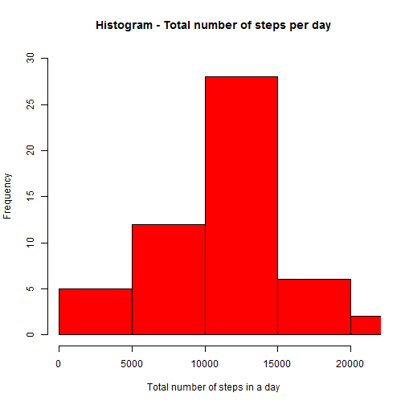
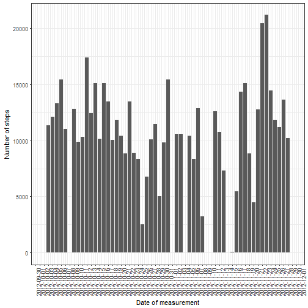
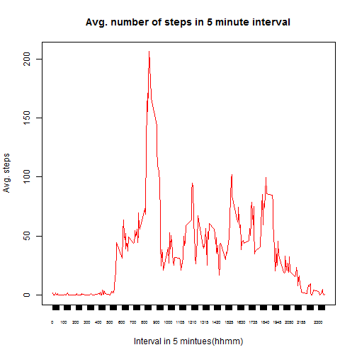
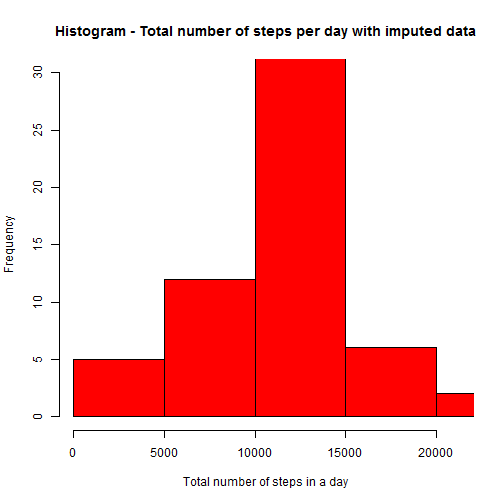
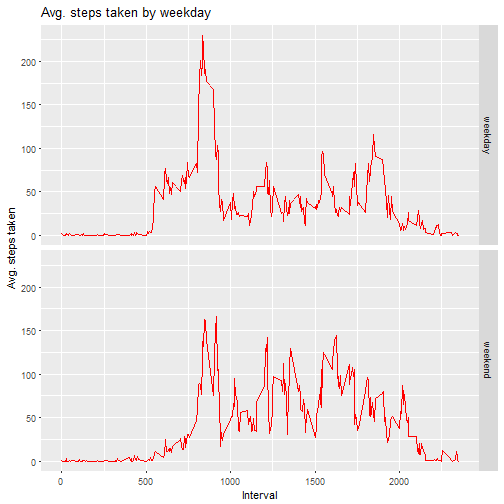

## Gathering Data
Fork and clone [gitHub repository for this assignment](https://github.com/rdpeng/RepData_PeerAssessment1). The data is available in 'Activity' folder under the name *activity.csv*. Make sure the CSV file is available in the working directory. The following R packages needs to be loaded for this assignment. 

```r
options(scipen=999)
library(lattice)
library(ggplot2)
library(data.table)
library(dplyr)
```


## Loading and preprocessing the data
Set current working directory and load the activity data.

```r
setwd('RepData_PeerAssessment1')
```

```r
activity <- read.csv(file='activity.csv',header = TRUE)
str(activity)
head(activity)
```

```
## 'data.frame':	17568 obs. of  3 variables:
##  $ steps   : int  NA NA NA NA NA NA NA NA NA NA ...
##  $ date    : Factor w/ 61 levels "2012-10-01","2012-10-02",..: 1 1 1 1 1 1 1 1 1 1 ...
##  $ interval: int  0 5 10 15 20 25 30 35 40 45 ...
##   steps       date interval
## 1    NA 2012-10-01        0
## 2    NA 2012-10-01        5
## 3    NA 2012-10-01       10
## 4    NA 2012-10-01       15
## 5    NA 2012-10-01       20
## 6    NA 2012-10-01       25
```

For this part of the assignment, you can ignore the missing values in the dataset.
1. Make a histogram of the total number of steps taken each day
2. Calculate and report the mean and median total number of steps taken per day


```r
# check for NA in date and interval
mean(is.na(activity$date))
mean(is.na(activity$interval))
# convert data to ccyy-mm-dd
activity$date <- as.Date(activity$date,"%Y-%m-%d")

##What is mean total number of steps taken per day?  (ignore 'NA')
## 1. Make a histogram of the total number of steps taken each day
ttl.steps.per.day<-na.omit(activity)%>% 
                   group_by(date) %>%
                   summarize(ttl.steps = sum(steps,na.rm=TRUE))
head(ttl.steps.per.day)
```

```
## [1] 0
## [1] 0
## # A tibble: 6 × 2
##         date ttl.steps
##       <date>     <int>
## 1 2012-10-02       126
## 2 2012-10-03     11352
## 3 2012-10-04     12116
## 4 2012-10-05     13294
## 5 2012-10-06     15420
## 6 2012-10-07     11015
```

```r
step.range<-range(ttl.steps.per.day$ttl.steps)
hist(ttl.steps.per.day$ttl.steps,main="Histogram - Total number of steps per day", 
     xlab="Total number of steps in a day",col="red",ylim=c(0,30),
     xlim=step.range)
```



```r
# 2. Calculate and report the mean and median total number of steps taken per day
mu.steps<-mean(ttl.steps.per.day$ttl.steps)
md.steps<-median(ttl.steps.per.day$ttl.steps)
```

**For question #2, the mean and median total number of steps taken per day are 10766 and 10765 respectively.**

Another alternate way of plotting steps per day is by plotting daily historgram using ggplot.

```r
dt.range<-range(ttl.steps.per.day$date)
ggplot(ttl.steps.per.day,aes(x=date, y=(ttl.steps)))+geom_histogram(stat="identity",binwidth = 0.1) +
  xlab("Date of measurement")+ylab("Number of steps")+
  scale_x_date( date_labels = "%Y-%m-%d",date_breaks = "1 day", 
                breaks=seq(min(ttl.steps.per.day$date), max(ttl.steps.per.day$date), 60),
                limits = dt.range)+
  theme_bw()+theme(axis.text.x = element_text(angle = 90, hjust = 1))
```




##What is the average daily activity pattern?

1. Make a time series plot (i.e. type = "l") of the 5-minute interval (x-axis) and the average number of steps taken, averaged across all days (y-axis)
2. Which 5-minute interval, on average across all the days in the dataset, contains the maximum number of steps?


```r
# 1.Make a time series plot (i.e. type = "l") of the 5-minute interval (x-axis) and the average number of steps taken, averaged across all days (y-axis)
avg.steps.per.interval<-na.omit(activity)%>% 
  group_by(interval) %>%
  summarize(avg.steps = mean(steps,na.rm=TRUE))  
avg.steps.per.interval
```

```
## # A tibble: 288 × 2
##    interval avg.steps
##       <int>     <dbl>
## 1         0 1.7169811
## 2         5 0.3396226
## 3        10 0.1320755
## 4        15 0.1509434
## 5        20 0.0754717
## 6        25 2.0943396
## 7        30 0.5283019
## 8        35 0.8679245
## 9        40 0.0000000
## 10       45 1.4716981
## # ... with 278 more rows
```

```r
plot(avg.steps.per.interval, type="l",main="Avg. number of steps in 5 minute interval",
     xlab="Interval in 5 mintues(hhmm)",ylab="Avg. steps",col="red",xaxt = "n")
axis(1, avg.steps.per.interval$interval, cex.axis = .5)
```



```r
# 2.Which 5-minute interval, on average across all the days in the dataset, contains the maximum number of steps?
max.steps<-avg.steps.per.interval[which.max(avg.steps.per.interval$avg.steps),]
max.steps
```

```
## # A tibble: 1 × 2
##   interval avg.steps
##      <int>     <dbl>
## 1      835  206.1698
```

For question #2, the interval 835 contains the maximum number of steps 206.

##Imputing missing values
1. Calculate and report the total number of missing values in the dataset (i.e. the total number of rows with NAs)
2. Devise a strategy for filling in all of the missing values in the dataset. The strategy does not need to be sophisticated. For example, you could use the mean/median for that day, or the mean for that 5-minute interval, etc.
3. Create a new dataset that is equal to the original dataset but with the missing data filled in.
4. Make a histogram of the total number of steps taken each day and Calculate and report the mean and median total number of steps taken per day. Do these values differ from the estimates from the first part of the assignment? What is the impact of imputing missing data on the estimates of the total daily number of steps?


```r
#1. Calculate and report the total number of missing values in the dataset (i.e. the total number of rows with NAs)
na.ttl<-sum(!complete.cases(activity))
na.ttl
```

```
## [1] 2304
```

__The total number of missing values in the dataset is 2304. __


```r
#2. Devise a strategy for filling in all of the missing values in the dataset. The strategy does not need to be sophisticated. For example, you could use the mean/median for that day, or the mean for that 5-minute interval, etc.
ttl.activities <- nrow(activity)
activity2 <- activity
for (i in 1:ttl.activities) {
  if (is.na(activity2[i,1])) {
    activity2[i,1] <- subset(avg.steps.per.interval,interval==activity2[i,3])$avg.steps
  }
}
 
#3. Create a new dataset that is equal to the original dataset but with the missing data filled in.
head(activity2)
```

```
##       steps       date interval
## 1 1.7169811 2012-10-01        0
## 2 0.3396226 2012-10-01        5
## 3 0.1320755 2012-10-01       10
## 4 0.1509434 2012-10-01       15
## 5 0.0754717 2012-10-01       20
## 6 2.0943396 2012-10-01       25
```

Histogram after imputing 'NA' values with mean inteval value. 

```r
#4. Make a histogram of the total number of steps taken each day and Calculate and report the mean and median total number of steps taken per day. 
#   Do these values differ from the estimates from the first part of the assignment? 
#   What is the impact of imputing missing data on the estimates of the total daily number of steps?
ttl.steps.per.day2<-activity2%>% 
  group_by(date) %>%
  summarize(ttl.steps = sum(steps))
head(ttl.steps.per.day2)
```

```
## # A tibble: 6 × 2
##         date ttl.steps
##       <date>     <dbl>
## 1 2012-10-01  10766.19
## 2 2012-10-02    126.00
## 3 2012-10-03  11352.00
## 4 2012-10-04  12116.00
## 5 2012-10-05  13294.00
## 6 2012-10-06  15420.00
```

```r
step.range2<-range(ttl.steps.per.day2$ttl.steps)
hist(ttl.steps.per.day2$ttl.steps,main="Histogram - Total number of steps per day with imputed data", 
     xlab="Total number of steps in a day",col="red",ylim=c(0,30),
     xlim=step.range2)
```



```r
# Mean and median calculation with impute values
mu.steps2<-mean(ttl.steps.per.day2$ttl.steps)
md.steps2<-median(ttl.steps.per.day2$ttl.steps)
mu.steps2
md.steps2
```

```
## [1] 10766.19
## [1] 10766.19
```

After imputing, the mean and median are 10766 and 10766 respectively. 

**As we used mean in the impute calculation, there is no change in the mean but the median has slightly changes.**

##Are there differences in activity patterns between weekdays and weekends?
 
1. Create a new factor variable in the dataset with two levels -- "weekday" and "weekend" indicating whether a given date is a weekday or weekend day.
2. Make a panel plot containing a time series plot (i.e. type = "l") of the 5-minute interval (x-axis) and the average number of steps taken, averaged across all weekday days or weekend days (y-axis). The plot should look something like the following, which was created using simulated data:


```r
# 1. Create a new factor variable in the dataset with two levels -- "weekday" and "weekend" indicating whether a given date is a weekday or weekend day.
activity2$weekday <- ifelse(weekdays(activity2$date) %in% c('Saturday','Sunday'),'Weekday','weekend')
activity2$weekday <- as.factor(activity2$weekday)
avg.steps.per.interval.by.weekday <- activity2 %>% group_by(weekday,interval) %>%
                                     summarize(avg.steps=mean(steps))
head(avg.steps.per.interval.by.weekday)
```

```
## Source: local data frame [6 x 3]
## Groups: weekday [1]
## 
##   weekday interval   avg.steps
##    <fctr>    <int>       <dbl>
## 1 Weekday        0 0.214622642
## 2 Weekday        5 0.042452830
## 3 Weekday       10 0.016509434
## 4 Weekday       15 0.018867925
## 5 Weekday       20 0.009433962
## 6 Weekday       25 3.511792453
```


```r
# 2. Make a panel plot containing a time series plot (i.e. type = "l") of the 5-minute interval (x-axis) and the average number of steps taken, averaged across all weekday days or weekend days (y-axis). 
#    The plot should look something like the following, which was created using simulated data:
g<-ggplot(avg.steps.per.interval.by.weekday,aes(x=interval,y=avg.steps))+geom_line(color="red")
g<-g+facet_grid(weekday~.)
g<-g+xlab("Interval") + ylab("Avg. steps taken")+ggtitle("Avg. steps taken by weekday") 
g
```



Remove all variables

```r
## remove datasets 
rm(avg.steps.per.interval.by.weekday,avg.steps.per.interval,activity2,activity,ttl.steps.per.day2,ttl.steps.per.day)
```

End of the document. (To create yourfilename.md file, use knit("yourfilename.Rmd")) 
